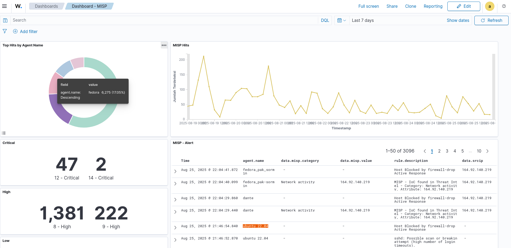
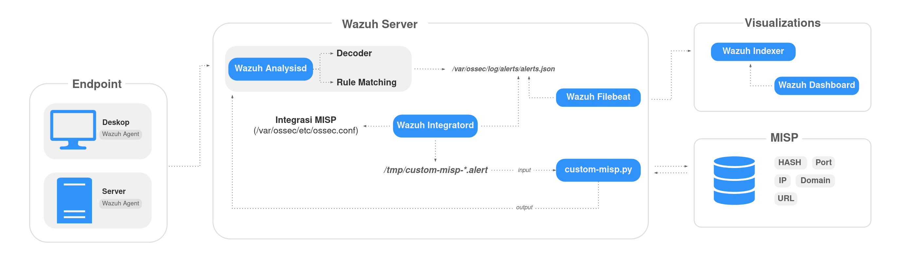

# Wazuh + MISP Project 
In the previous series, we have successfully installed Wazuh as our open source siem platform and this time we will integrate Wazuh with MISP (Malware Information Sharing Platform). The project aims to automate threat detection by attracting the Compression (IOC) from MISP and automatically applying it to Wazuh agents.

## Features
- Detection of threat-based **log correlation**.
- Integration with **MISP** for threat intelligence.
- Custom Active Response.
- Automatically alternating with custom rules.

## Architecture

Event types / Rule groups to trigger MISP API calls
 

| Event Type              | Metadata (Win / Linux)                | Rationale                                                      |
|--------------------------|---------------------------------------|----------------------------------------------------------------|
| Sysmon event 1          | `win.eventdata.hashes`                | Check existing IoCs in process image file hash                 |
| Sysmon event 3          | `win.eventdata.destinationIp` / `eventdata.destinationIp` | Check existing IoCs in destination IP (if public IPv4)         |
| Sysmon event 6          | `win.eventdata.hashes`                | Check existing IoCs in loaded driver file hash                 |
| Sysmon event 7          | `win.eventdata.hashes`                | Check existing IoCs in loaded DLL file hash                    |
| Sysmon event 15         | `win.eventdata.hashes`                | Check existing IoCs in downloaded file hash                    |
| Sysmon event 22         | `win.eventdata.queryName`             | Check existing IoCs in queried hostname                        |
| Wazuh Syscheck (Files)  | `syscheck.sha256_after`               | Check existing IoCs in files added/modified/removed (file hash)|

 

If there are any obstacles, be sure to always read/access official documentation: https://documentation.wazuh.com/

Thank you for using this guide. Good luck! 🙌

